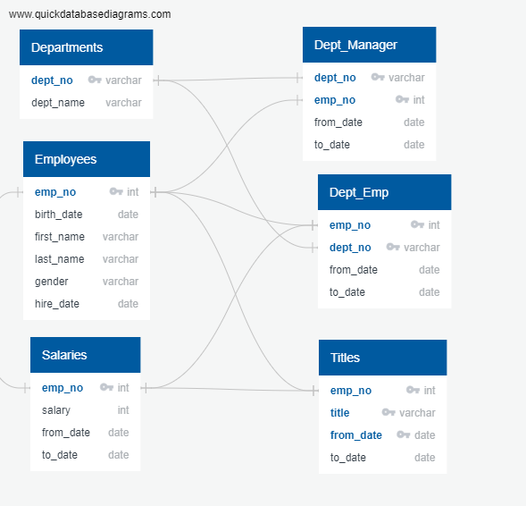
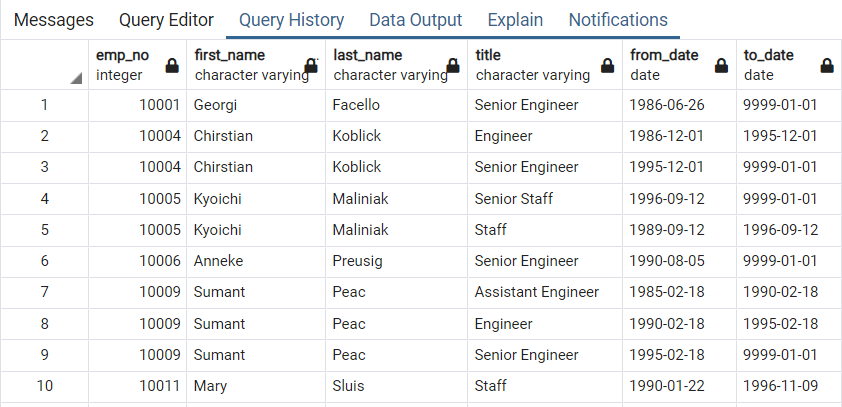
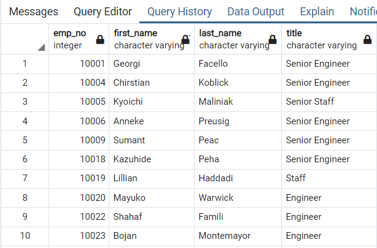
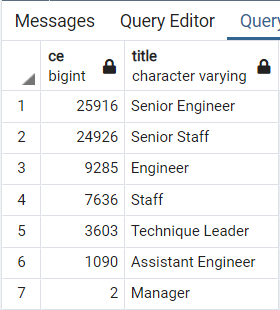
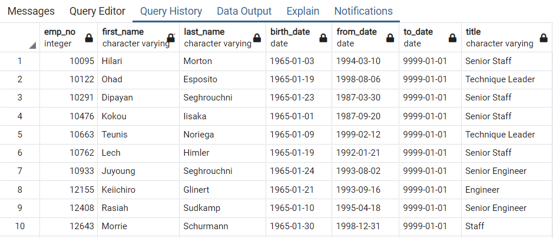
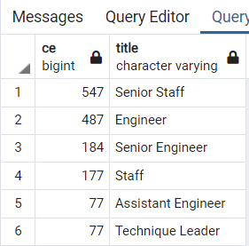

#### Challenge 7: Module 7

# Overview of the Project

## Purpose of Pewlett Hackard Analysis

The first part of Module 7 consisted in the creation of an ERD for data visualization. The ERD shows 6 tables representing each csv file with their respective column names and the type of value located in it. It also shows the connections between each file using primary keys, as can be seen in Image 1. The ERD was a useful tool for the challenge, it was necessary to review those tables before writing the code to see specific connections.

###### Image 1. ERD.

After the review of the ERD, the main purpose of the challenge was to create a database analysis to see the retirement employees with their most recent job title. Selected employees must borned between January 1, 1952 and December 31, 1955, and they need to be currently working in the company. A mentorship-eligibility table was also created with employees borned in 1965, to visualize possible mentors for the program.
The intention of the Pewlett Hackard analysis is to obtain specific information of the future retirement employers from each department to be able to prepare the hire stage and their training with some mentors.

# Results

## Part 1:

The first part of the analysis included three new tables. The first one consists of a table created by two csv files “titles” and “employees”. The table is in Image 2. with the results of employees that were born between 1952 and 1955, and their specific information like title, employee number, first and last name.
The table shows that some employees have more than one title, so the code needed to be modified to keep just the last title of each one.

###### Image 2. Employees with Retirement Titles.

The following instructions of Part 1 focuses on changing the table to obtain just current employees and keep just the most recent title of each. The final table is in Image 3. and is ordered by employee number.

###### Image 3. Current Employees from 1952 to 1955 with their Last Title.

After having all the data filtered, a table counting each title was created and appears in Image 4. Some important observations are going to be explained in the next two points.
* The most relevant result from the table is the huge amount of Senior Engineers that are going to be possible retired employees.
* The other important number extracted from the table is the total number of future retired employees, it is a lot of qualified people that will leave the company soon.

###### Image 4. Retiring Titles.

## Part 2:

The final part of the Challenge was about the creation of a mentorship table. The data came from “employees”, “department employee” and “titles” tables. It was filtered with current employees borned in 1965 with their last title. The final Mentorship Eligibility table is located at Image 5. and the two important points to analyze are above.
* Observing the results from the table, it can be said that a lot of future retired employees can be incorporated in the mentorship program.
* The other point is the total number of possible mentors, that is 1549 employees. It is a low number compared to the number of new employees that will require a mentor. It is important to see how many new employees will have one mentor and if each department has at least one mentor. 

###### Image 5. Mentorship Eligibility.

# Summary
As a conclusion of all the final tables, it is shown that a lot of employees are going to leave the company soon and those positions are going to need a replacement. It is important for the company to know what places and which departments are going to need someone before employees leave. The most important roles that need to be filled are going to be Senior Engineer and Senior Staff because those titles have a huge amount of employees compared to the others, as Image 4. shows at the table.
The results of Image 5. shows all the employees that will be retired that can help as mentors. The total number of possible mentors is 1,549  and the total number of future hired employees that will require training with a mentor is 72,458. There will be a lot of new employees and few possible mentors. An additional table was created to see the total number of retired employees from each department that could be mentors in the program, located in Image 6. The results showed that the company needs to create a plan because the number of Senior Engineers that are going to leave the company is quite higher than the number of possible mentors required for the training of new employees for those free places. Also, there will be no mentor for those new two managers, because there is no future retired employee that had the specifications needed.

###### Image 6. Total Number of Possible Mentors from each Department.

